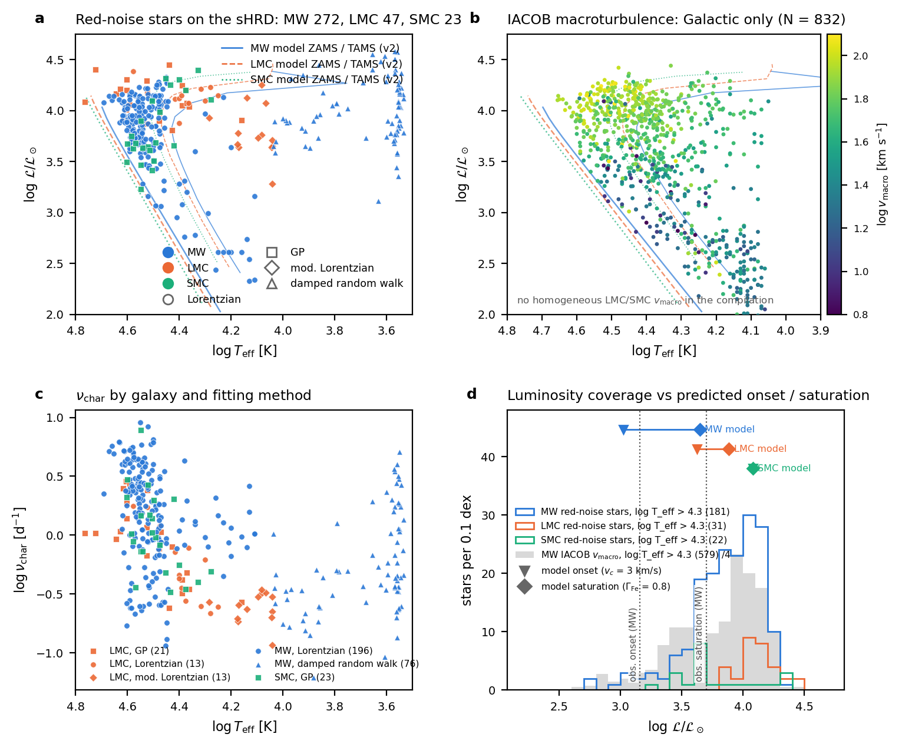
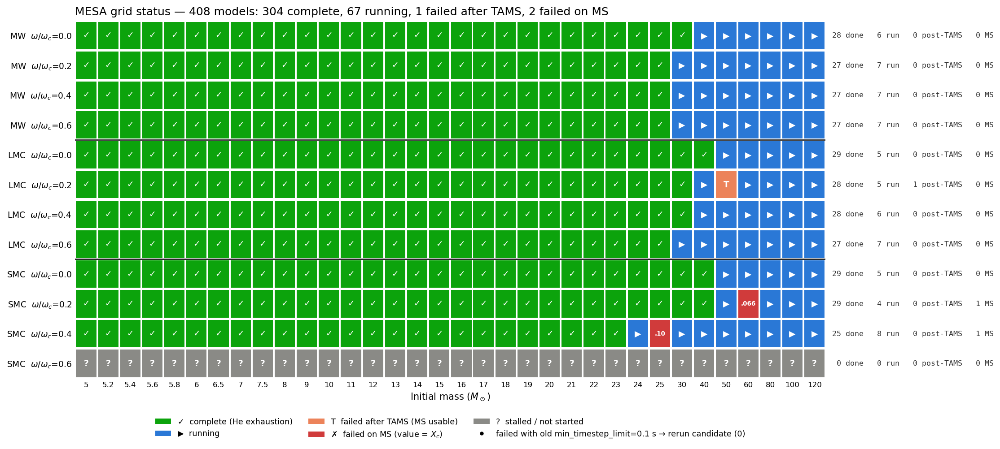
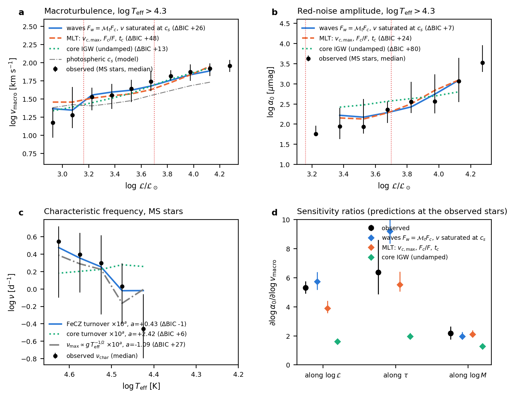
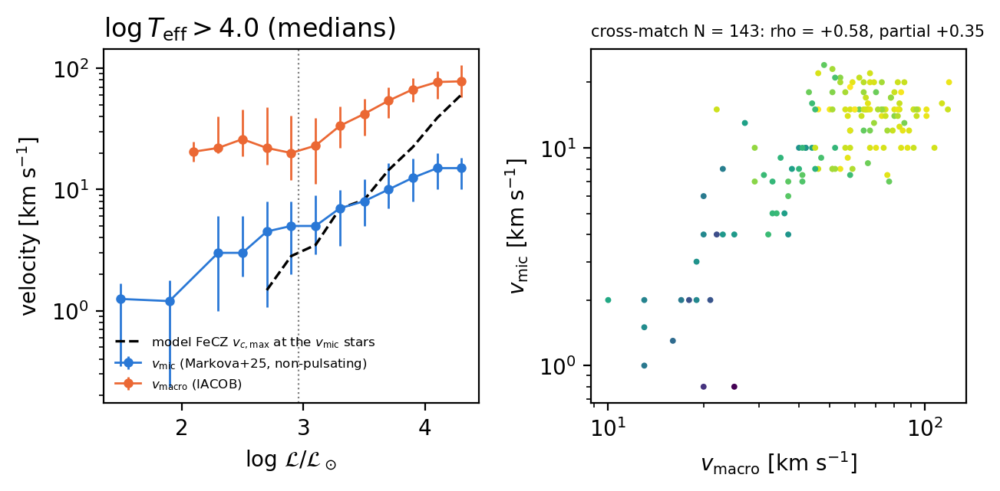
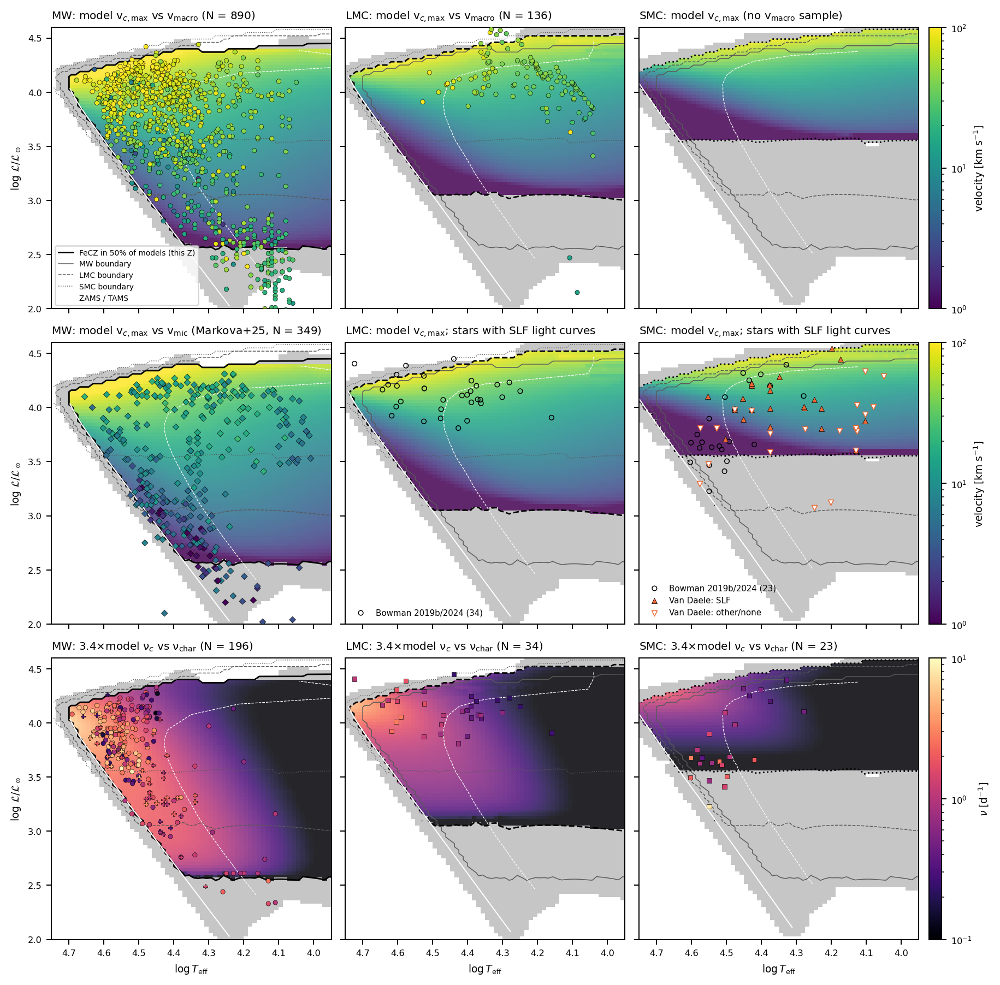
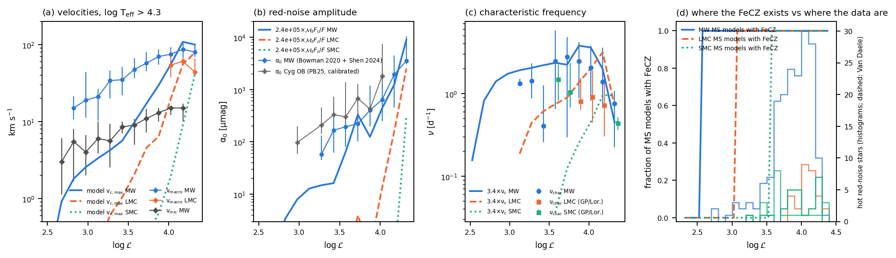
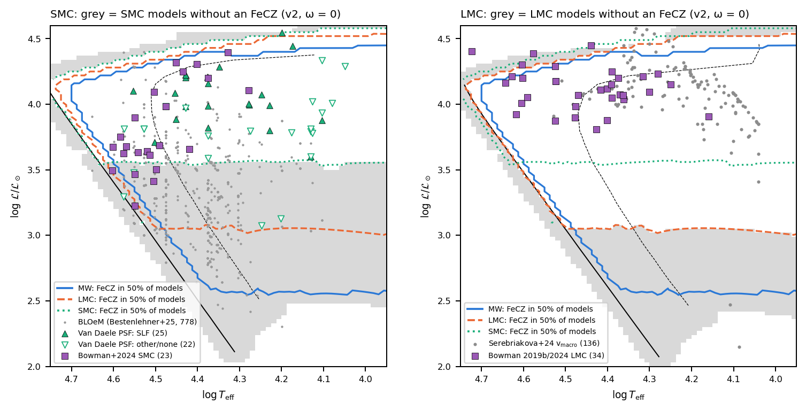
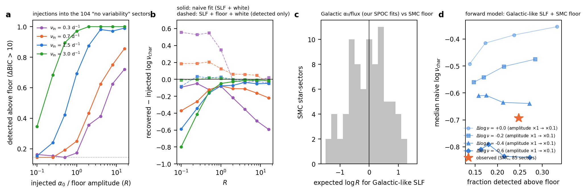

# Red noise and macroturbulence in massive stars: where we stand

*Plain-language summary, 2026-09-25. For the technical detail behind each point see the `analysis_mesa/REPORT_*.md` files
named in each section. For the to-do list and running jobs see [`STATUS.md`](STATUS.md).*

---

## 1. The question in one paragraph

Hot massive stars show two kinds of "noise": their brightness flickers randomly (**red noise**, or stochastic low-frequency
variability, SLF), and their spectral lines are broadened by large-scale surface motions (**macroturbulence**, v_macro; and
on smaller scales **microturbulence**, v_mic). Two explanations compete:
- **(1) Internal gravity waves (IGWs) from the convective core** travel out to the surface.
- **(2) A thin convection zone just below the surface, driven by the iron opacity bump (the FeCZ)**, stirs the surface
  directly.

The two predict different patterns across the HR diagram, with age, and with **metallicity**: less iron means a weaker FeCZ,
or none at all. We test both against every dataset we could find, using a new grid of MESA stellar models.

## 2. What we have

**Data.** About 490 stars with red-noise fits from eight studies, about 900 Galactic stars with macroturbulence, and about
440 with microturbulence. The Magellanic Clouds (lower metallicity) add ~150 LMC stars with macroturbulence and a few dozen
LMC/SMC red-noise stars.

*The data by galaxy. (a) Red-noise stars on the spectroscopic HR diagram (ℒ ∝ T_eff⁴/g, so the vertical axis is roughly "how
close to the Eddington limit"). (b) Galactic macroturbulence. (c) The characteristic frequency ν_char by galaxy and fitting
method. (d) Where each galaxy's hot stars sit in luminosity, compared with where the models say the FeCZ switches on (▼) and
saturates (◆).*

**Models.** A new grid (v2) of 408 MESA r26.04 models: Milky Way, LMC and SMC composition; 34 masses from 5 to 120 M☉; four
rotation rates. It has a consistent Asplund (2009) mixture and fixed diagnostics for rotating models. It is about 75%
complete; all the masses relevant to the data are done. The first version of the grid (v1) was retired because it mixed
composition prescriptions.

*Grid status, 25 Sep 17:00. Green = finished, blue = running (high masses), red = failed (2 SMC models to rerun), grey = SMC
fastest rotation not yet started.*

## 3. What we found

### 3.1 The FeCZ explains the Galactic patterns; core waves do not
Along the models' main sequence we computed the FeCZ's convective velocity, its share of the flux, its Mach number and its
turnover frequency. We then tried a series of simple "recipes" that turn these into v_macro, the red-noise amplitude α₀ and
ν_char, testing all three observables at once.
- **The best recipe:** surface velocity ≈ FeCZ velocity, amplitude ∝ Mach number × convective flux fraction, and frequency ≈
  3.4 × the FeCZ turnover frequency. It beats the purely empirical fits.
- **Core IGWs fail badly.** They miss by orders of magnitude in amplitude and have the wrong trends.
- **The model predicts where macroturbulence switches on** (log ℒ ≈ 3.0 in the data, 2.9–3.3 in the models).
- **The model does not reproduce the saturation of v_macro** in the hottest, most luminous stars. There the 1D convection
  theory keeps predicting faster motions. This fits 3D simulations, where convection in that regime is no longer "efficient".

*Three recipes against the Galactic data (earlier MW-only version of this comparison): (a) macroturbulence, (b) red-noise
amplitude, (c) frequency, (d) how much the amplitude changes per unit change in velocity, along luminosity, age and mass. The
FeCZ recipes (blue, orange) follow the data; core waves (green) do not.*

### 3.2 Several claims in the draft paper need softening
- **Only macroturbulence has a clean "switch-on".** The paper said the red-noise amplitude also switches on at log ℒ ≈ 3.1.
  With the new homogeneous data (Pedersen & Bildsten 2025) that break disappears. It was created by mixing in LMC stars
  measured on a different scale. Galactic amplitudes rise smoothly with luminosity, which the models also predict.
  (`REPORT_pb25.md`)
- **Microturbulence behaves like a weaker macroturbulence.** It rises smoothly with ℒ, has no threshold, matches the model
  FeCZ velocity in the middle of the range, and shares star-to-star fluctuations with v_macro. (`REPORT_vmic.md`)
- **Rotation is not a strong lever:** giving each star its own rotation does not improve the fits. (`REPORT_rotation_Z.md`)
- **Magnetic stars are not quieter.** Magnetic OB stars have red noise at least as strong as normal stars at the same
  position. Too few have fields above the value that should suppress the FeCZ to make this a sharp test. (`REPORT_magnetic.md`)

*Microturbulence (blue) vs macroturbulence (orange) and the model FeCZ velocity (dashed), and the v_mic–v_macro correlation.*

### 3.3 Metallicity: the key test, and what the new models say
Lower metallicity pushes the FeCZ to higher luminosity. The new models quantify how far: the FeCZ first appears at
log ℒ ≈ **2.6 (Milky Way), 3.05 (LMC), 3.55 (SMC)**.

*Models against data in each galaxy (columns MW, LMC, SMC). The background colour is the model FeCZ property; grey means no
FeCZ. Black lines mark where the FeCZ appears (dashed and dotted: the other two galaxies). The points are the observations on
the same colour scale. Row 1: model convective velocity vs v_macro. Row 2: model velocity vs v_mic (MW), and the stars with
red-noise light curves (LMC, SMC). Row 3: model frequency (×3.4, set on the MW only) vs ν_char.*

What the metallicity comparison shows:
- **LMC agrees with the models.** Using the scale factor fixed on Galactic stars, the LMC red-noise frequencies land on the
  LMC model prediction (difference 0.01 dex). LMC macroturbulence is lower than Galactic at the same ℒ, in the direction the
  models predict; the size of the shift (+0.4 to +0.6 dex in ℒ) sits within the model range. (`REPORT_lmc_vmac.md`)
- **The fitting-method worry is smaller than we thought.** The paper said Galactic and Magellanic ν_char could not be compared
  because they were fitted differently. Digitising Bowman & Dorn-Wallenstein (2022), where 30 stars were fitted both ways,
  shows the methods agree on average (−0.02 dex, with 0.19 dex scatter). (`REPORT_nuchar_Z.md`)
- **SMC: a tension to take seriously.** The SMC red-noise stars (Bowman et al. 2024) cluster right at the SMC FeCZ boundary.
  There the models have only a very weak FeCZ and predict frequencies about **10× lower** than observed. Well above the
  boundary the SMC data and models agree. So either the red noise of stars with a marginal FeCZ has another source, or the
  simple turnover frequency is the wrong quantity near threshold.

*Hot stars against luminosity: (a) velocities, (b) red-noise amplitude, (c) frequency, observed (points) and model (lines)
for MW, LMC and SMC. (d) The fraction of models with an FeCZ at each metallicity (lines), with where each galaxy's red-noise
stars sit (histograms).*

### 3.4 The SMC light curves of Van Daele et al. (2026), and our exchange with them
Van Daele et al. extracted TESS light curves for 91 SMC stars and concluded that SLF looks "similar to Galactic stars", so the
mechanism "could be insensitive to metallicity". In our email exchange (logged in `Vandaele_correspondence/README.md`, which
is private and not in git) Matteo argued that their faint-star sample is biased towards high masses, where even SMC stars
still have an FeCZ. Their published version softened the claim. We can now test both points:
- **The selection bias is real, and large.** 62% of the SMC spectroscopic sample (BLOeM) sits where SMC models have *no*
  FeCZ, but **none of their 24 SLF detections do**. Their light curves never probe the region that would test the FeCZ idea.
- **Their SLF is hard to separate from noise.** We refitted their light curves ourselves:
  - Star by star we can't reproduce their numbers. Small, undocumented choices in the fit move ν_char by ~0.2 dex.
  - Stars they class as "not variable" give almost the same fitted "SLF" as their SLF stars. The faint-star photometry has a
    red-noise floor that looks like SLF.
  - We modelled that floor and injected fake signals to see what can be recovered. Galactic-like SLF would sit right at the
    floor, and the data disfavour SMC stars having Galactic-like SLF at Galactic frequencies. SMC SLF is weaker, slower, or
    both. That is what the FeCZ picture expects, but the result depends on the floor model, so treat it as a hint.
  (`REPORT_vandaele.md`, `REPORT_mw_smc.md`, `REPORT_floor.md`)

*Left: SMC. Grey = SMC models without an FeCZ; coloured lines = where the FeCZ appears at MW, LMC and SMC metallicity. Small
grey dots: the whole BLOeM spectroscopic sample. Triangles: Van Daele light curves (filled = SLF). Squares: Bowman et al. 2024.
Right: the same for the LMC.*

*Injecting fake SLF into the SMC light curves of non-variable stars. (a) How often it is detected above the floor, vs its
strength relative to the floor. (b) How far off the recovered frequency is. (c) How strong Galactic-like SLF would be relative
to the floor in these stars. (d) The observed SMC sample (star) against what Galactic-like, slower or weaker SLF would look
like.*

## 4. The bottom line so far

1. **In the Milky Way the FeCZ picture works:** it gets the onset, the trends with luminosity and age, the link between
   brightness noise and line broadening, and microturbulence right. Core IGWs don't.
2. **What it doesn't get right:** the saturation of macroturbulence in the most luminous stars. Probably a limit of 1D
   convection theory, since 3D simulations point the same way.
3. **Metallicity is the decisive test, and it is now partly possible.** The LMC agrees with the models. The SMC samples mostly
   don't probe the region where the FeCZ vanishes, so "SLF is seen in the SMC" doesn't contradict the FeCZ picture. Near the
   SMC threshold, though, the observed frequencies are higher than the FeCZ predicts, and that needs an explanation.
4. **Some statements in the paper draft must change:** no clean α₀ switch-on; the metallicity comparison is no longer blocked
   by the fitting method; add microturbulence, the LMC shift, magnetic stars, and a discussion of Van Daele et al.

## 5. What comes next

- **Finish the grid** (high masses, SMC fastest rotation, two reruns), then move the paper's model section to the v2 grid.
- **Test whether Van Daele's two groups** (massive main-sequence stars vs cooler evolved stars) correspond to two different
  convection zones in the models (iron vs helium).
- **Understand the SMC frequency tension:** check the detection strength of the Bowman 2024 stars near the threshold.
- **Measure the SMC noise floor independently**, from non-target stars in the same images.
- **Send the (drafted) email to Van Daele**, asking for their per-sector fits and settings.
- **Revise the paper** (list in `STATUS.md` §4), including two wrong bibliography entries found by the new citation checker.

*Along the way we also built reusable tools, now Claude Code skills: light-curve red-noise fitting, extracting numbers from
published figures, and checking citations. They are listed in `STATUS.md` §2b.*
